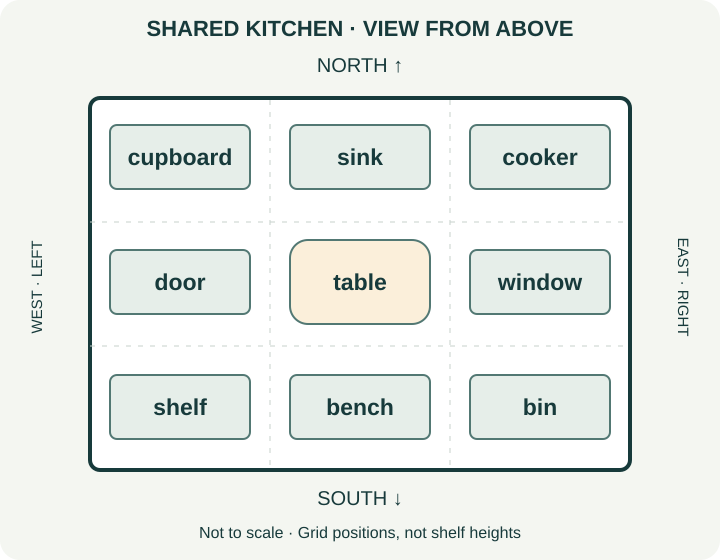

# A103-place · Где находится и куда перемещается: место, направление и понятные инструкции

[Топик A103](../modules/A103.md). Сгенерировано из data/*.mjs.

Предпосылки: [A103-quantity](A103-quantity.md).

## Цели контроля

- Описывать расположение относительно названного ориентира
- Отличать положение от пути и пересечения границы
- Учитывать точку зрения, схему и неизвестную высоту
- Давать связные инструкции и уточнять ответ партнёра

## Механизм

### Предлог связывает два участника

The cup is on the table называет cup, отношение on и ориентир the table. Без ориентира слушатель не знает, где искать. The table is under the cup описывает обратное отношение, но часто менее полезно для задачи поиска чашки. Сначала реши, что неизвестно собеседнику и какой объект он уже видит. Русское «на» не даёт одного английского предлога: на кухне — in the kitchen, на столе — on the table, на работе — at work. Выбор зависит от устройства и привычного представления места, не от буквального перевода.

### In, on, at — не линейка размера

In выделяет внутреннее пространство: in a drawer, in the kitchen. On связывает с поверхностью: on a shelf, on the wall. At представляет точку/место деятельности: at the door, at the desk. Большое место тоже может быть точкой в маршруте: at the station. In the station подчёркивает внутренность здания. Поэтому многие реальные ситуации допускают at и in с разным акцентом; без контекста нельзя объявлять один универсальным ответом. В закрытых задачах прямо задаём внутренность, поверхность или рабочую точку.

### Соседство, противоположность и группа

Next to — непосредственно рядом, near — недалеко, но без обещания соседства. Opposite — напротив: магазин через дорогу, а не обязательно adjacent. Between связывает различимые ориентиры, например between the sink and the cooker. Among описывает положение среди группы: among the boxes. Запрет between для более двух объектов слишком грубый: отношения между отдельно рассматриваемыми участниками могут включать больше двух. На начальном этапе учим ясную пару и группу, но не создаём ложного абсолютного правила.

### Высота и плоская схема

Above/below описывают выше/ниже, under часто ниже предмета, over может быть над ним, покрывать или обозначать путь — значение требует контекста. The clock is above the shelf — реальная высота на стене. На плане комнаты вид сверху: предмет вверху страницы находится ближе к северной стороне, а не обязательно физически висит выше другого. Наша схема явно помечена view from above и not to scale. Расстояния, размеры и высоты нельзя вычислять по условному рисунку, если они не заданы отдельно.

### Положение, направление и граница

Jo is walking in the kitchen — ходит внутри кухни. Jo is walking into the kitchen — входит, пересекает границу. The cup is on the shelf — положение; Jo is moving it onto the shelf — направление к поверхности. Однако с put, fall, jump часто возможны in/into или on/onto с близким смыслом: Put it in the drawer корректно. Into/onto подчёркивают переход, но нельзя выбирать их только потому, что в предложении есть любой глагол движения. Человек может walking in the park, не entering it.

### Откуда, через что и с какой стороны

From отмечает исходную точку, to — пункт назначения, out of — изнутри наружу, off — с поверхности. Across показывает пересечение пространства от стороны к стороне, through — путь через внутренность/проход: across the square, through the doorway. Walk to the kitchen не гарантирует, что человек уже вошёл; into выделяет вход. В инструкции Take the cup off the shelf and put it in the drawer важно сохранить и источник, и результат. Не меняй out of на off, если предмет находился внутри ящика.

### Лево, право и перед требуют точки зрения

На схеме север сверху, запад слева и восток справа. Это постоянная ориентация страницы. Но left/right человека зависит от того, куда он смотрит: повернувшись, он меняет свою левую сторону. Перед Turn left спроси Where are you standing? Which way are you facing? У шкафа может быть собственный перед — дверцы; in front of the cupboard опирается на него, а не всегда на направление взгляда автора. На незнакомой схеме не добавляй такие отношения, если ориентация предмета не задана.

### Частые готовые сочетания и региональные различия

Go home — без to, но be at home. In the car — обычное место пассажира, on the bus — на борту, by bus — способ поездки. On the first floor требует системы этажей: UK first floor обычно над ground floor, US first floor часто на уровне входа с улицы. Для передачи точного адреса уточни one level above the street entrance. Это поддержка обоих вариантов, не ошибка одного из них. Предлоги времени at six/on Monday/in July не выводятся из пространственной картинки: они уже изучались отдельно в P02.

### Инструкция проверяется действием и ответом

Назови исходную точку, ориентир, направление и итог; давай шаги в порядке выполнения. Партнёр должен пересказать маршрут или расположить предметы по инструкции, а не просто согласиться yes. Если он спрашивает Which shelf?, это сигнал недостаточного ориентира. Исправь конкретную неоднозначность, не добавляя случайные длинные предложения. В письменном описании соедини there is/are, определённые предметы the, предлоги и текущие действия из A102. Речь и фонетику проверяй по аудио; правильная строка ASR не доказывает понятность маршрута.

## Примеры с разбором

- **The spoons are in the drawer.** — Ложки в ящике. Внутреннее пространство.
- **The drawer is under the worktop.** — Ящик под столешницей. Отношение к ориентиру.
- **The plate is on the worktop.** — Тарелка на столешнице. Поверхность.
- **Jo is at the sink.** — Джо у мойки. Рабочая точка.
- **The clock is above the door.** — Часы над дверью. Высота на стене.
- **The door is below the clock.** — Дверь ниже часов. Обратное отношение.
- **The bin is next to the cupboard.** — Мусорное ведро рядом со шкафом. Непосредственное соседство.
- **The shop is near the building.** — Магазин недалеко от здания. Не обязательно соседняя дверь.
- **The shop is opposite the library.** — Магазин напротив библиотеки. Противоположные стороны.
- **The sink is between the cupboard and the cooker.** — Мойка между шкафом и плитой. Два ясных ориентира.
- **There is a label among the papers.** — Среди бумаг есть этикетка. Член группы.
- **There is a bench in front of the house.** — Перед домом скамья. Опора на фасад дома.
- **The garden is behind the house.** — Сад за домом. Отношение к задней стороне.
- **Jo is walking in the hall.** — Джо ходит в коридоре. Движение внутри области.
- **Jo is walking into the hall.** — Джо входит в коридор. Пересечение границы.
- **Put the box in the cupboard.** — Поставь коробку в шкаф. In допустимо с put.
- **Move the box onto the shelf.** — Перемести коробку на полку. Выделено направление к поверхности.
- **Take the jar out of the cupboard.** — Достань банку из шкафа. Изнутри наружу.
- **Take the jar off the shelf.** — Сними банку с полки. С поверхности.
- **Walk across the courtyard.** — Перейди двор. От одной стороны к другой.
- **Walk through the passage.** — Пройди через проход. Через внутреннее пространство.
- **I go home by bus.** — Я еду домой автобусом. Без to перед home; by — способ поездки.
- **I am on the bus, not in the car.** — Я в автобусе, не в машине. Устойчивые модели.
- **The room is one level above the street entrance.** — Комната на один уровень выше входа с улицы. Без неоднозначного first floor.

## Ориентир и положение

1. **Краткий ответ:** Ложка внутри закрытого ящика: in/on the drawer?
2. **Краткий ответ:** Книга лежит на верхней поверхности стола: on/under the table?
3. **Краткий ответ:** Коробка на полу под столом: under/above the table?
4. **Краткий ответ:** Часы прикреплены к стене выше таблички: above/below the notice?
5. **Краткий ответ:** Если часы выше таблички, табличка below/above the clock?
6. **Краткий ответ:** Слева шкаф, справа плита, мойка в середине ряда: between/among?
7. **Краткий ответ:** Красная чашка в группе белых чашек: among/opposite?
8. **Краткий ответ:** Магазин прямо через дорогу от банка: opposite/in the bank?
9. **Краткий ответ:** Near the station доказывает next to the station? Yes/no.
10. **Краткий ответ:** Обычный пассажир внутри легковой машины: in/on the car?
11. **Краткий ответ:** Обычный пассажир автобуса: on/under the bus?
12. **Краткий ответ:** Способ поездки: by/in bus, без артикля?
13. **Предложение:** Исправь обычное местонахождение: I am on the kitchen.
14. **Предложение:** Исправь: I go to home after work.
15. **Развёрнутый ответ:** Почему at the station и in the station могут быть оба допустимы?
16. **Развёрнутый ответ:** Сравни The keys are in the desk и at the desk.
17. **Развёрнутый ответ:** Перепиши The fridge is next to the cupboard начиная с cupboard.
18. **Развёрнутый ответ:** Объясни, почему предмет вверху плана не обязательно висит выше другого.
19. **Развёрнутый ответ:** Уточни Go to the first floor для собеседника с другой системой этажей.
20. **Развёрнутый ответ:** Опиши одну точку двумя предлогами: книга внутри коробки, коробка на столе.
21. **Развёрнутый ответ:** Назови отношения in front of/behind с домом, у которого известен фасад.
22. **Развёрнутый ответ:** Почему between не следует запрещать при трёх различимых участниках?

Ключи и критерии после попытки

1. Ключ: in. Внутренность, не поверхность.
2. Ключ: on. Контакт с поверхностью.
3. Ключ: under. Предмет под столом, на полу: отношение under.
4. Ключ: above. Реальная высота задана.
5. Ключ: below. Обратное отношение.
6. Ключ: between. Различимые ориентиры.
7. Ключ: among. Among задаёт положение внутри группы предметов.
8. Ключ: opposite. Магазин через дорогу напротив банка: opposite.
9. Ключ: no. Недалеко не равно непосредственному соседству.
10. Ключ: in. Нейтральное положение в машине.
11. Ключ: on. Обычная модель местонахождения пассажира — on the bus.
12. Ключ: by. By bus называет способ поездки и не требует артикля.
13. Ключ: I am in the kitchen. / I'm in the kitchen.. Внутри помещения.
14. Ключ: I go home after work.. Home без to после go.
15. Возможный образец (не единственный ответ): At treats the station as a location; in emphasises being inside it.. Контекст, не шкала размеров.
16. Возможный образец (не единственный ответ): In places them inside the desk; at locates them at the work area, less precisely.. Смысл зависит от выбранной области.
17. Возможный образец (не единственный ответ): The cupboard is next to the fridge.. Соседство симметрично в этой ситуации.
18. Возможный образец (не единственный ответ): A top-down plan shows horizontal positions, not vertical heights.. Не смешивать координаты.
19. Возможный образец (не единственный ответ): Do you mean the street-entry level or one level above it?. Нужно согласование UK/US.
20. Возможный образец (не единственный ответ): The book is in the box. The box is on the table.. Нельзя заменить книгу на стол без связи.
21. Возможный образец (не единственный ответ): There is a bench in front of the house and a garden behind it.. Ориентир имеет перед/зад.
22. Возможный образец (не единственный ответ): It can express separate relationships involving more than two participants; number alone is not the rule.. Не ложный абсолютный запрет.

## Местонахождение и путь

1. **Краткий ответ:** Человек пересекает порог, входя: walking in/into the room? Выбери форму, явно выделяющую вход.
2. **Краткий ответ:** Человек уже внутри и ходит там: walking in/into the room?
3. **Краткий ответ:** Кошка сейчас лежит на стуле: on/onto the chair?
4. **Краткий ответ:** Кошка перемещается с пола на стул: onto/out of?
5. **Краткий ответ:** Достать ложку изнутри ящика: out of/off the drawer?
6. **Краткий ответ:** Снять ложку с поверхности стола: off/into the table?
7. **Краткий ответ:** Перейти открытую площадь от края до края: across/through the square?
8. **Краткий ответ:** Пройти через внутренность тоннеля: through/onto the tunnel?
9. **Краткий ответ:** Пункт назначения: walk to/from the shop, если идём туда?
10. **Краткий ответ:** Исходная точка: come from/onto the shop, если идём оттуда?
11. **Краткий ответ:** Put the bowl in the cupboard обязательно ошибочно из-за движения? Yes/no.
12. **Развёрнутый ответ:** Сравни Put it on the shelf и Put it onto the shelf.
13. **Развёрнутый ответ:** Walking to the building гарантирует пересечение порога?
14. **Развёрнутый ответ:** Напиши последовательность: вынь чашку из шкафа, поставь на поднос, перенеси поднос к столу.

Ключи и критерии после попытки

1. Ключ: into. Граница пересекается.
2. Ключ: in. Движение внутри, не вход.
3. Ключ: on. Кошка уже на поверхности, поэтому on, а не onto.
4. Ключ: onto. Направление к поверхности.
5. Ключ: out of. Источник внутри.
6. Ключ: off. Отделение от поверхности.
7. Ключ: across. Через пространство.
8. Ключ: through. Внутренний проход.
9. Ключ: to. Направление к магазину.
10. Ключ: from. From вводит исходную точку движения — магазин.
11. Ключ: no. С put допускается in.
12. Возможный образец (не единственный ответ): Both can describe placing it on the shelf; onto gives more emphasis to movement.. Не отвергать on автоматически.
13. Возможный образец (не единственный ответ): No. To gives a destination; into explicitly describes entering.. Не делать лишний вывод.
14. Возможный образец (не единственный ответ): Take the cup out of the cupboard. Put it on the tray. Carry the tray to the table.. Источник, предмет и итог не теряются.

## Кухня на схеме: вид сверху и точка зрения

Схема для чтения: вид сверху, не в масштабе. На узком экране прокручивайте схему по горизонтали; полное текстовое описание — ниже.

This is a teaching plan of a shared kitchen, viewed from above. North is at the top of the page, west is on the left and east is on the right. The plan is not to scale. It shows positions, not the exact sizes or heights of furniture. All the positions can also be read in the following description, so you do not need to see the image to answer the questions.
Along the north side, there is a cupboard on the left, a sink in the middle and a cooker on the right. The sink is between the cupboard and the cooker. In the middle row, the door is on the left, the table is in the centre and the window is on the right. Along the south side, there is a shelf on the left, a bench in the middle and a bin on the right.
Mina is writing directions for a new volunteer. She does not say that the sink is physically above the table just because it appears higher on the page. She also does not guess how many cups are inside the cupboard; the plan does not show its contents. Before telling the volunteer to turn left, she asks which way the person is facing. The page has a fixed west side, but a person's left changes when they turn around. The volunteer reads the directions back and asks about any unclear object before moving it.

1. **Краткий ответ:** Какое направление наверху схемы? North/south.
2. **Краткий ответ:** Что между шкафом и плитой в северном ряду?
3. **Краткий ответ:** Что слева от стола на схеме?
4. **Краткий ответ:** Что справа от стола на схеме?
5. **Краткий ответ:** Что между полкой и ведром в южном ряду?
6. **Краткий ответ:** Схема показывает точную высоту мойки? Yes/no.
7. **Краткий ответ:** Можно измерить длину кухни в метрах по этой схеме? Yes/no.
8. **Краткий ответ:** У северной стены cupboard находится слева или справа от sink? Left/right.
9. **Краткий ответ:** Если человек повернулся, его left обязательно остаётся west? Yes/no.
10. **Краткий ответ:** Число чашек в шкафу известно? Yes/no.
11. **Развёрнутый ответ:** Опиши северный ряд тремя связанными предложениями.
12. **Развёрнутый ответ:** Что надо спросить перед Turn left человеку у двери?
13. **Развёрнутый ответ:** Соедини наличие и положение стола, не приписывая ему размер.
14. **Развёрнутый ответ:** Предложи две инструкции с названными предметами и уточни неизвестное содержимое.

Ключи и критерии после попытки

1. Ключ: north. Это явно обозначенная ориентация.
2. Ключ: sink / the sink. Мойка в середине.
3. Ключ: door / the door. Западная позиция среднего ряда.
4. Ключ: window / the window. Восточная позиция.
5. Ключ: bench / the bench. Скамья в середине.
6. Ключ: no. Вид сверху, высоты нет.
7. Ключ: no. Not to scale, размеров нет.
8. Ключ: left. По ориентации страницы.
9. Ключ: no. Лево зависит от взгляда.
10. Ключ: no. Содержимое не показано.
11. Возможный образец (не единственный ответ): The cupboard is on the left. The sink is between the cupboard and the cooker. The cooker is on the right.. Указана ориентация схемы.
12. Возможный образец (не единственный ответ): Which way are you facing?. Его взгляд не определяется положением автора.
13. Возможный образец (не единственный ответ): There is a table in the middle row. It is between the door and the window on this plan.. Положение есть, масштаба нет.
14. Возможный образец (не единственный ответ): Go to the cupboard and check whether there are any cups inside. If there are, put two on the table.. Условие не объявляет чашки существующими.

## Убираем комнату: откуда и куда

Транскрипт — только после прослушивания и попытки

Hi, Jo. Please help me put a few things away. The keys are in the kitchen drawer. Take them out of the drawer and put them in the small bowl by the entrance. There are some books on the kitchen table. Take them off the table and put them on the lower shelf, not the upper one. The upper shelf is full. Then walk out of the kitchen and through the hall to the bench beside the front door. Please put the empty shopping bag under that bench. Stay inside the building; you don't need to go through the front door. Leave the hall window closed because it is raining. If you are not sure which shelf I mean, ask before moving the books.

1. **Краткий ответ:** Где сначала лежат ключи: shelf или drawer?
2. **Краткий ответ:** Куда надо положить ключи: bowl или cupboard?
3. **Краткий ответ:** Книги находятся на столе? Yes/no.
4. **Краткий ответ:** Куда перенести книги: upper shelf или lower shelf?
5. **Краткий ответ:** Почему не верхняя: full или broken?
6. **Краткий ответ:** Какое помещение пройти после кухни?
7. **Краткий ответ:** Нужно выйти из здания? Yes/no.
8. **Краткий ответ:** Окно нужно открыть или оставить закрытым? Open/closed.
9. **Развёрнутый ответ:** Напиши первый шаг с правильным источником и целью.
10. **Развёрнутый ответ:** Передай инструкцию о книгах, сохранив ограничение полки.
11. **Развёрнутый ответ:** Почему Which shelf? — полезный вопрос в этой ситуации?
12. **Устная работа:** Перескажи партнёру маршрут из кухни к скамье и проверь его пересказ.

Ключи и критерии после попытки

1. Ключ: drawer. Ключи сначала находятся внутри kitchen drawer.
2. Ключ: bowl. В миску у входа.
3. Ключ: yes. Их надо снять со стола.
4. Ключ: lower shelf. Названа lower shelf; верхняя полка уже занята.
5. Ключ: full. Она занята, не сломана.
6. Ключ: hall / the hall. После кухни нужно пройти через hall к входной двери.
7. Ключ: no. Остаёмся внутри.
8. Ключ: closed. Закрытым из-за дождя.
9. Возможный образец (не единственный ответ): Take the keys out of the drawer and put them in the bowl by the entrance.. Изнутри в другую ёмкость.
10. Возможный образец (не единственный ответ): Take the books off the table and put them on the lower shelf; the upper shelf is full.. Off с поверхности, lower не теряется.
11. Возможный образец (не единственный ответ): Using the wrong shelf would conflict with the instruction; the lower shelf is the intended destination.. Уточнение ориентира.
12. Возможный образец (не единственный ответ): Walk out of the kitchen, through the hall and to the bench beside the front door. Stay inside.. Нужны источник, путь и конечная точка.

## Описание помещения и работа собеседника

1. **Развёрнутый ответ:** Опиши три предмета в своей или вымышленной комнате с разными ориентирами.
2. **Развёрнутый ответ:** Дай инструкцию из двух шагов: банка из шкафа на стол, ложка из ящика в миску.
3. **Развёрнутый ответ:** Объясни человеку, как ориентирован план, прежде чем использовать left/right.
4. **Развёрнутый ответ:** Напиши 100–140 слов новому помощнику: кухня, шкаф у входа, чашки внутри, стол у окна; две чашки поставить на поднос на столе; книги перенести с нижней полки в коробку под столом; содержимое верхнего шкафа неизвестно. Добавь уточнение.
5. **Развёрнутый ответ:** Перепиши The bowl is near the cooker так, чтобы сообщить непосредственное соседство, не просто близость.
6. **Развёрнутый ответ:** Напиши просьбу уточнить этаж, не выбирая UK или US за собеседника.
7. **Развёрнутый ответ:** Сравни walking across the room и walking through the doorway в полном сообщении.
8. **Развёрнутый ответ:** Напиши десять реплик: предмет, источник, цель, неясный ориентир, уточнение и обратное повторение.
9. **Развёрнутый ответ:** Исправь буквальный перевод I am on work and the keys are on my bag: ключи внутри сумки.
10. **Развёрнутый ответ:** Составь описание без предположений о высоте по виду сверху.
11. **Устная работа:** Партнёр раскладывает три предмета по твоим словам; сравни результат и уточни одно отношение.
12. **Устная работа:** Различи out of/off и in/into в четырёх устных фразах с показом действия.
13. **Устная работа:** Попроси собеседника повернуться, затем проверь, где его left по отношению к северу.
14. **Развёрнутый ответ:** После вопроса Which shelf? перепиши свою инструкцию точнее, сохранив старую версию.

Ключи и критерии после попытки

1. Возможный образец (не единственный ответ): There is a chair by the desk. A lamp is on the desk. The bag is under the chair.. Не три повтора in с заменой слова.
2. Возможный образец (не единственный ответ): Take the jar out of the cupboard and put it on the table. Take the spoon out of the drawer and put it in the bowl.. Все источники и цели.
3. Возможный образец (не единственный ответ): North is at the top of this plan. Left means the west side of the page, not necessarily your left as you stand in the room.. Точка зрения явно обозначена.
4. Возможный образец (не единственный ответ): The kitchen is at the end of the hall. There is a cupboard beside its entrance, and there are clean cups inside it. The table is by the window. Please take two cups out of the cupboard and put them on the tray on the table. There are some books on the lower shelf. Take the books off that shelf and put them in the box under the table. Please do not move anything from the upper cupboard; I don't know what is inside it yet. If there are two boxes under the table, ask me which one to use. Please read the steps back before you start.. Чёткая последовательность, известное и неизвестное, источник и итог; допускаются in/into и on/onto по смыслу.
5. Возможный образец (не единственный ответ): The bowl is next to the cooker.. Задано усиление точности; нельзя считать его исходным фактом без новой инструкции.
6. Возможный образец (не единственный ответ): Is the room at street-entry level or one level above it?. Неискажённый адрес важнее формального номера.
7. Возможный образец (не единственный ответ): Walk across the room to the far wall, then go through the doorway into the hall.. Разные виды пути.
8. Возможный образец (не единственный ответ): A: Where are the cups? B: In the cupboard by the door. A: Where should I put them? B: On the tray. A: Which tray? B: The blue tray on the table. A: All the cups? B: No, just two. A: Two cups from the cupboard onto the blue tray? B: Yes, that's right.. Десять связанных реплик; уточнение меняет точность действия.
9. Возможный образец (не единственный ответ): I am at work, and the keys are in my bag.. Устойчивое at work и физическое in.
10. Возможный образец (не единственный ответ): The sink is on the north side of the plan. Its height is not shown.. Не подменять north физическим above.
11. Возможный образец (не единственный ответ): Put the pen in the box, place the box beside the book and put the cup behind the book.. Предметы реальные или условные; нужна обратная связь.
12. Возможный образец (не единственный ответ): Take it out of the drawer. Take it off the shelf. Walk in the room. Walk into the room.. Слушатель связывает фразу с действием.
13. Возможный образец (не единственный ответ): Which way are you facing now? Is west on your left or your right?. Ответ зависит от реального положения, не фиксированного ключа.
14. Возможный образец (не единственный ответ): Original: Put it on the shelf. Revised: Put it on the lower shelf beside the door.. Реальное уточнение своего текста.

## Связная опись и отсроченный перенос

1. **Краткий ответ:** The sign is on the wall: поверхность или внутренность? Surface/inside.
2. **Краткий ответ:** Go home требует to перед home? Yes/no.
3. **Краткий ответ:** Вид сверху даёт высоту полки без размеров? Yes/no.
4. **Краткий ответ:** There ___ two boxes under the shelf. Is/are?
5. **Краткий ответ:** There ___ a box of tools under the shelves. Is/are?
6. **Краткий ответ:** Put the box on the table обязательно хуже грамматически, чем onto? Yes/no.
7. **Развёрнутый ответ:** Объедини артикли и отсылку: впервые шкаф, затем его расположение у двери.
8. **Развёрнутый ответ:** Четыре чашки внутри шкафа, нужны шесть. Напиши опись и запрос без путаницы места/количества.
9. **Развёрнутый ответ:** Различи at six и at the sink по функции.
10. **Развёрнутый ответ:** Почему рисунок с западом слева не гарантирует, что собеседник должен повернуть налево?
11. **Развёрнутый ответ:** Соедини обычный маршрут и текущий вход: обычно Jo идёт на кухню в восемь, сейчас входит в коридор.
12. **Развёрнутый ответ:** Напиши краткое сообщение о непроверенном шкафе без обещания содержимого.
13. **Устная работа:** Через семь дней составь маршрут по другому помещению; партнёр должен пройти его или пересказать.
14. **Развёрнутый ответ:** Запиши один вопрос, который помог бы проверить твоё описание до отправки.

Ключи и критерии после попытки

1. Ключ: surface. On связывает с поверхностью.
2. Ключ: no. Устойчивая модель без to.
3. Ключ: no. Высота не показана.
4. Ключ: are. Возвращается число.
5. Ключ: is. Главное слово box.
6. Ключ: no. On допустимо с put.
7. Возможный образец (не единственный ответ): There is a cupboard in the room. The cupboard is beside the door.. A → the в связном описании.
8. Возможный образец (не единственный ответ): There are four cups in the cupboard. We need two more.. Сначала проверенный запас.
9. Возможный образец (не единственный ответ): At six gives a time; at the sink gives a location.. Одна форма, разные отношения.
10. Возможный образец (не единственный ответ): The person may be facing a different direction; their left is not fixed to the page.. Нужна точка зрения.
11. Возможный образец (не единственный ответ): Jo usually goes to the kitchen at eight. Now Jo is walking into the hall.. Возвращаются Simple/Continuous и движение.
12. Возможный образец (не единственный ответ): The cupboard is beside the window, but I don't know what is inside it.. Место известно, содержимое нет.
13. Возможный образец (не единственный ответ): Start at the door, walk to the desk and put the bag under it. Which desk do you see?. Новый контекст, не повтор схемы.
14. Возможный образец (не единственный ответ): Does the reader know which doorway and which direction I mean?. Оценка собственной фактической работы.

## Обязательный итоговый тест

Не подменять тренировочными задачами. Ученик может вводить целые предложения и тексты, сохранять черновик и продолжать позже. Ключи открывать после отправки всей попытки. Открытые задания оцениваются по смыслу и критериям; устные требуют слышимого аудио. Записать исходные ответы и отдельный разбор по целям, назначить практику по пробелам.

### Вариант A

1. **Краткий ответ:** Ключ внутри конверта: in/on the envelope?
2. **Краткий ответ:** Конверт лежит на поверхности скамьи: on/under the bench?
3. **Краткий ответ:** На стене лампа выше зеркала: зеркало above/below the lamp?
4. **Краткий ответ:** В ряду слева холодильник, в середине стол, справа дверь: table is between/among?
5. **Краткий ответ:** Человек входит снаружи в гараж: явно выдели вход, in/into the garage?
6. **Краткий ответ:** Человек уже ходит внутри гаража: in/into the garage?
7. **Краткий ответ:** Снять пакет с верхней поверхности шкафа: off/out of the cupboard?
8. **Краткий ответ:** Перейти через открытую лужайку от стороны к стороне: across/through the lawn?
9. **Краткий ответ:** Пройти сквозь внутренний коридор: through/onto the corridor?
10. **Краткий ответ:** На плане сверху предмет севернее другого; его физическая высота известна? Yes/no.
11. **Краткий ответ:** Left человека всегда west независимо от поворота? Yes/no.
12. **Предложение:** Исправь: They are going to home now.
13. **Развёрнутый ответ:** Поясни near a school против next to a school.
14. **Развёрнутый ответ:** Оцени Put the folder in the drawer и Put it into the drawer без механического запрета.
15. **Развёрнутый ответ:** Коллега говорит first floor без страны. Задай вопрос о фактическом уровне.
16. **Развёрнутый ответ:** Напиши пять связанных предложений: коробка под столом, документы внутри; два документа положить на верхнюю полку; содержимое шкафа неизвестно.
17. **Развёрнутый ответ:** Опиши место человека у рабочего стола и поясни, почему in the desk — другой смысл.
18. **Развёрнутый ответ:** Новая словесная схема: северный ряд bookcase–door–window. Что можно и чего нельзя вывести о двери?
19. **Устная работа:** Дай партнёру путь от входа к столу и задачу с предметом. Ответь на его Which table?
20. **Устная работа:** Продиктуй два действия, различив изнутри ящика и с поверхности полки.

Разбор — только после отправки попытки

1. Ключ: in. Предмет находится внутри конверта, поэтому in.
2. Ключ: on. Предмет лежит на поверхности опоры, поэтому on.
3. Ключ: below. Обратное отношение высоты.
4. Ключ: between. Различимые ориентиры.
5. Ключ: into. Пересечение границы.
6. Ключ: in. Положение движения.
7. Ключ: off. Поверхность, не внутренность.
8. Ключ: across. Пересечение площади.
9. Ключ: through. Внутренний путь.
10. Ключ: no. План не задаёт высоту.
11. Ключ: no. Лево определяется направлением взгляда человека, не постоянным западом.
12. Ключ: They are going home now. / They're going home now.. Без to перед home.
13. Возможный образец (не единственный ответ): Near is an unspecified short distance; next to describes immediate adjacency.. Не взаимозаменять без данных.
14. Возможный образец (не единственный ответ): Both can describe the same placement; into stresses the movement inside.. Открытая проверка допустимых вариантов.
15. Возможный образец (не единственный ответ): Do you mean the street-entry level or one level above it?. UK/US не выбираются наугад.
16. Возможный образец (не единственный ответ): There is a box under the table. The documents are inside it. Take two documents out of the box. Put them on the upper shelf. I don't know what is in the cupboard.. Источники, число, цель и неизвестность.
17. Возможный образец (не единственный ответ): Jo is at the desk. In the desk would mean inside it, not working at it.. Область vs точка деятельности.
18. Возможный образец (не единственный ответ): It is between the bookcase and the window in that row. Its height and width are not given.. Новое расположение, без повторения учебной кухни.
19. Возможный образец (не единственный ответ): Walk to the table beside the window, then put the bag under it.. Живое уточнение; критерии по слышимому ответу.
20. Возможный образец (не единственный ответ): Take the pen out of the drawer. Take the notebook off the shelf.. Слушатель должен различить источники.

### Вариант B

1. **Краткий ответ:** Монета внутри кошелька: in/on the wallet?
2. **Краткий ответ:** Кошелёк лежит на поверхности подноса: on/under the tray?
3. **Краткий ответ:** На стене картина ниже часов: часы above/below the picture?
4. **Краткий ответ:** Маленькая коробка среди группы больших: among/opposite the boxes?
5. **Краткий ответ:** Посетитель входит в библиотеку: явно выдели вход, in/into the library?
6. **Краткий ответ:** Посетитель уже бродит внутри библиотеки: in/into the library?
7. **Краткий ответ:** Вынуть шарф изнутри сумки: off/out of the bag?
8. **Краткий ответ:** Перейти улицу от одной стороны к другой: across/through the street?
9. **Краткий ответ:** Пройти через внутренность арки: through/onto the archway?
10. **Краткий ответ:** План not to scale позволяет вычислить метры по длине рисунка? Yes/no.
11. **Краткий ответ:** Направление right человека известно только по слову entrance? Yes/no.
12. **Предложение:** Исправь: She goes to home by bus.
13. **Развёрнутый ответ:** Сравни opposite a bank и next to a bank.
14. **Развёрнутый ответ:** Поясни допустимость Put the cup on the tray и Put it onto the tray.
15. **Развёрнутый ответ:** Гость не знает системы этажей. Переформулируй нужный этаж: один уровень над входом с улицы.
16. **Развёрнутый ответ:** Напиши пять предложений: корзина у двери, полотенца внутри; три полотенца на нижнюю полку; закрытая коробка не проверена.
17. **Развёрнутый ответ:** Различи in the car и by car в двух предложениях.
18. **Развёрнутый ответ:** Новая схема сверху: южный ряд freezer–sink–door. Опиши sink и не придумывай его высоту.
19. **Устная работа:** Проведи партнёра к полке и уточни его положение перед указанием left.
20. **Устная работа:** Различи переход на скамью и положение на скамье двумя устными фразами.

Разбор — только после отправки попытки

1. Ключ: in. Внутреннее пространство.
2. Ключ: on. Предмет лежит на поверхности опоры, поэтому on.
3. Ключ: above. Физическая высота задана.
4. Ключ: among. Положение в группе.
5. Ключ: into. Граница пересекается.
6. Ключ: in. Движение внутри.
7. Ключ: out of. Внутренний источник.
8. Ключ: across. Пересечение улицы.
9. Ключ: through. Путь через проход.
10. Ключ: no. Масштаб не задан.
11. Ключ: no. Нужно знать взгляд.
12. Ключ: She goes home by bus.. После go слово home употребляется без to.
13. Возможный образец (не единственный ответ): Opposite is across from it; next to is adjacent to it.. Разные отношения.
14. Возможный образец (не единственный ответ): Both can describe placing the cup there; onto highlights the movement to the surface.. Не считать on ошибкой автоматически.
15. Возможный образец (не единственный ответ): The room is one level above the street entrance.. Без неоднозначного first.
16. Возможный образец (не единственный ответ): There is a basket by the door. The towels are in it. Take three towels out of the basket. Put them on the lower shelf. I don't know what is in the closed box.. Количество, источник, цель и ограничение.
17. Возможный образец (не единственный ответ): Jo is in the car now. Jo usually travels by car.. Местонахождение и способ поездки.
18. Возможный образец (не единственный ответ): The sink is between the freezer and the door in the south row. Its height is not shown.. Новый контекст, не прежняя схема.
19. Возможный образец (не единственный ответ): Where are you standing, and which way are you facing? The shelf is beside the window.. Диалог определяет маршрут.
20. Возможный образец (не единственный ответ): The cat is jumping onto the bench. The cat is on the bench.. Понятность перехода и результата проверяется слушателем.

## Повторение и ограничения

При пробелах вернитесь к соответствующей практике; затем используйте следующий вариант. Повтор уже знакомого варианта не доказывает перенос. После использования обоих вариантов требуется новый независимый контроль с преподавателем. Через 7 дней — применение в новой ситуации; до него первичная успешная проверка не означает окончательное освоение. [Критерии](../TEACHING.md).

## Приложения

- [Место и направление: ориентиры, границы и устойчивые сочетания](../appendices/place.md)
- [Наличие и количество: формы, определители и порции](../appendices/quantity.md)
- [Числа, порядковые формы, дни, месяцы и время](../appendices/numbers-time.md)

## Источники для сверки

Объяснения и упражнения авторские.

- [Cambridge: at, on and in — place](https://dictionary.cambridge.org/grammar/british-grammar/at-on-and-in-place)
- [Cambridge: in and into](https://dictionary.cambridge.org/grammar/british-grammar/in-into)
- [Cambridge: on and onto](https://dictionary.cambridge.org/us/grammar/british-grammar/on-onto)
- [Cambridge: between and among](https://dictionary.cambridge.org/us/grammar/british-grammar/between-or-among)
- [Cambridge: at, in and to — movement](https://dictionary.cambridge.org/us/grammar/british-grammar/at-in-and-to-movement)
