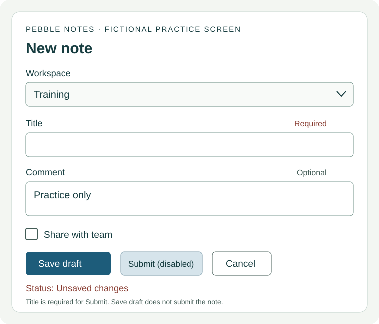

# T01-interface · Элементы интерфейса, действия и сообщения о состоянии

[Топик T01](../modules/T01.md). Сгенерировано из data/*.mjs.

Предпосылки: [A203-obligation](A203-obligation.md), [A205-patterns](A205-patterns.md).

## Цели контроля

- Строить команды, запреты и вопросы о состоянии
- Выбирать действие и точно называть элемент
- Различать обязательность, доступность и результат
- Понимать устные указания, поправки и подтверждения
- Писать понятные указания и точный отчёт
- Уточнять цель и проверять понимание в диалоге

## Механизм

### Сначала цель, затем элемент и действие

Пользователь хочет сохранить черновик, отправить заявку или изменить настройку — это разные цели. Даже грамматически верная фраза Click Submit неверна по задаче, если нужен только private draft. Начни с вопроса What do you want to do? Затем называй конкретный объект: the Title field, the Save draft button. File — отдельный файл, folder/directory — папка/каталог; label — подпись, а не введённое значение. В этой подтеме экраны Pebble Notes и Harbour Tasks вымышлены. Ты описываешь их и пишешь учебные ответы: никакие реальные заявки, рабочие проекты и личные данные отправлять не требуется.

### Императив: команда без обычного подлежащего

В обычной письменной инструкции начинаем с базовой формы: Open the menu. Enter a title. Слово you обычно не нужно, окончание -s не добавляется: Opens the menu не обычная команда. Для запрета используй Don’t/Do not + base: Do not close the window. Не Don’t closes и не Not close. Be также принимает эту модель: Be careful; don’t be late. Do not в документации не обязательно выражает злость; please может смягчать просьбу, но не делает ошибочную команду полезной. У you-императивов есть отдельные разговорные функции; здесь отрабатывается нейтральная инструкция без него.

### Действие, просьба и наблюдение

Select Training — указание, Could you select Training? — просьба, Training is selected — состояние. Could + subject + base не требует selected: Could you selected неверно. В The fields are empty согласование зависит от fields, не от расположенной рядом кнопки. В вопросе Is the field empty? / Are the fields empty? be выходит перед подлежащим; для действия Do you see the message? используется do. Внутри Can you tell me which option is selected? подлежащее which option само стоит перед is; Can you tell me where the field is? сохраняет порядок the field is. Короткое Yes полезно раскрыть, если неизвестно, на какой вопрос оно отвечает.

### Элементы и их подписи

Button запускает действие, field принимает значение, checkbox обозначает независимое включение/выключение, list предлагает выбор, tab открывает раздел, dialog запрашивает отдельное решение. Не всякий список — drop-down: этим словом описывают раскрывающийся вариант. Фраза In the Title field, enter Practice различает имя элемента Title и вводимый текст Practice. В учебных ответах допускаются кавычки или другое ясное выделение; оформление конкретной документации зависит от её style guide, а не от универсального закона грамматики. Назови подпись, не только цвет/расположение: интерфейс может отличаться по теме, размеру и способу доступа.

### Click, tap, press, enter и select

Click описывает щелчок мышью, tap — касание сенсорного экрана, press — нажатие клавиши; enter/type — ввод значения. Select удобно для выбора элемента или значения без привязки к мыши. Press Enter — нажать клавишу, enter a title — ввести текст: одинаковое написание Enter/enter здесь не означает одинаковое действие. Click the button и click on the button грамматически возможны; редакционный выбор не надо выдавать за запрет английского. Если устройство неизвестно, не придумывай сочетание клавиш. У разных приложений один и тот же shortcut может работать по-разному, поэтому реальную инструкцию сначала проверяют.

### Check и clear: устранить двусмысленность

Check the checkbox может пониматься как поставить флажок или проверить его состояние. Если цель — включить опцию, скажи Select the Share with team checkbox или Make sure it is selected. Если нужно только посмотреть, скажи Check whether it is selected. Clear the checkbox — снять флажок, clear the field — удалить текст из поля; это разные объекты. Toggle означает переключение текущего состояния, поэтому без знания исходного состояния оно не гарантирует on. Назови желаемый итог: Turn on notifications. Местоимение в turn it on стоит между глаголом и частицей; turn on it в этой модели не подходит.

### Required, optional и empty

Required говорит, что значение необходимо по правилу формы, а не что поле уже заполнено. Empty говорит о текущем отсутствии значения, а не о разрешении пропуска. Optional разрешает оставить поле пустым, но не запрещает ввод. You must enter a title before submission — обязательность, You don’t have to add a comment — отсутствие необходимости; You mustn’t add a comment — уже запрет. В Pebble Notes заголовок обязателен именно для Submit, но незавершённый draft можно сохранить без него. Не расширяй условие конкретного действия на всё приложение. Не угадывай required только по цвету или звёздочке без объяснения интерфейса.

### Enabled, disabled, selected и read-only

Enabled означает, что элемент доступен для действия, disabled — что он сейчас недоступен; ни одно слово не сообщает, что действие уже выполнено. Selected относится к выбранному значению/опции. Видимый элемент не обязательно доступен, а disabled не обязательно скрыт. Read-only — значение доступно для чтения, но не для редактирования; это не синоним пустого или ненужного. В обычных HTML-контролах readonly и disabled технически различаются, в том числе по фокусу/отправке формы; здесь изучается смысл сообщений, не полный стандарт HTML. Внешний вид и причины недоступности зависят от приложения: спрашивай What message do you see? вместо угадывания причины по серому цвету.

### Save, submit, upload и download

Save сохраняет данные в месте, определённом приложением; само слово не обещает облако, резервную копию или хранение навсегда. Submit отправляет заполненное для обработки, но нажатие кнопки не подтверждает получение. Upload передаёт файл от локального устройства к сервису, download — с сервиса на устройство в обычной пользовательской модели. Import/export описывают ввод/вывод данных относительно приложения и сами не определяют сетевое направление. Поэтому exported не обязательно uploaded. Close закрывает окно/редактор, delete удаляет объект; cancel обычно прерывает действие, но точные последствия надо читать в конкретном предупреждении, не угадывать по одному слову.

### Кнопка предлагает действие, статус сообщает состояние

Save draft на кнопке — доступная команда. Saving — процесс. Draft saved — сообщение о результате с областью, заданной приложением. Unsaved changes говорит, что есть несохранённые изменения; это не обязательно означает отсутствие более старой сохранённой версии. Sending ещё не Sent/Request received. Received означает получение в указанной системе, а не прочтение человеком, одобрение или завершение работы. Pending может значить ожидание очереди/решения: уточняй, чего именно ждут. If the status is still Sending, wait for a result сохраняет различие между процессом и итогом, а не гарантирует успех через заданное время.

### Место, порядок и временная опора

Полезные модели документации: in the field/menu/dialog, on the page/tab, from the list, into the folder. Это изучаемые сочетания в конкретном значении, не правило «всё внутри = in»: контекст может допускать другие конструкции. Сначала сообщи место, если иначе непонятно действие: On the New note page, enter a title. Before you close the editor, save the draft; before closing the editor тоже возможно, если действующий человек понятен. Before + -ing не требует to. After you choose Save draft, check the message задаёт порядок, но само не доказывает, что сохранение удалось. Условия и ожидаемый результат важнее механического списка first/then/finally.

### Устное уточнение и проверка понимания

В диалоге не повторяй одну команду громче при непонимании. Спроси Which page are you on? What is selected? Do you mean Save draft or Submit? Дай собеседнику назвать фактическое состояние, затем ответь именно на него. Сохраняй исходную цель: если он хочет private draft, не включай share ради завершённости сценария. Попроси пересказать следующий шаг и ожидаемое сообщение; повтор слов без правильного действия/смысла не всегда достаточен. В учебном диалоге партнёр вносит реальное уточнение или ошибку, а ты реагируешь. Написанный сценарий полезен для подготовки, но не заменяет живое взаимодействие.

### Произношение, новые задачи и граница этой подтемы

Произнеси пары save/saved, select/selected, send/sent в целой фразе и сделай слышимым not там, где оно меняет инструкцию. Saved обычно /seɪvd/, selected заканчивается /ɪd/; send и sent различаются конечным согласным. Не добавляй лишний русский гласный после конечной группы. Можно говорить в нормативном UK или US варианте; ASR может неправильно записать окончание и не является оценкой фонетики. Без реального аудио pronunciation/oral fluency остаются unknown. После практики — новый тест, адресная работа над ошибкой и новая задача через 7 дней. T01 пока partial: чтение документации, пути/символы и полноценные процедуры с восстановлением будут отдельными наполненными подтемами, не пустыми страницами.

## Примеры с разбором

- **Open the New note page.** — Открой страницу New note. Базовая форма команды.
- **Do not submit the draft yet.** — Пока не отправляй черновик. Do not + base.
- **Could you select the training workspace?** — Можешь выбрать учебное пространство? Просьба, не отчёт о выборе.
- **The workspace is selected.** — Рабочее пространство выбрано. Состояние с is.
- **Are both fields empty?** — Оба поля пусты? Plural subject и are.
- **Does the message say Draft saved?** — В сообщении написано Draft saved? Do/does для смыслового say.
- **In the Title field, enter Screen practice.** — В поле Title введи Screen practice. Подпись не вводимое значение.
- **On the Review tab, check the status.** — На вкладке Review проверь статус. On the tab в этой модели.
- **Choose Training from the Workspace list.** — Выбери Training из списка Workspace. Выбор из набора.
- **Click Save draft.** — Нажми Save draft мышью. Команда по точной подписи.
- **Tap the same label on the touch screen.** — Коснись той же подписи на сенсорном экране. Другой способ ввода.
- **Press Enter, but do not type the word Enter.** — Нажми Enter, а не печатай слово Enter. Клавиша и ввод текста различны.
- **Select the Notify reviewers checkbox.** — Установи флажок Notify reviewers. Желаемое состояние включено.
- **Check whether the checkbox is selected.** — Проверь, установлен ли флажок. Проверка состояния, не команда включить.
- **Clear the checkbox, not the text field.** — Сними флажок, а не очищай текстовое поле. Объект меняет действие.
- **Turn it off before the next exercise.** — Выключи это перед следующим упражнением. Местоимение внутри phrasal verb.
- **The title is required for submission.** — Заголовок необходим для отправки. Требование связано с действием.
- **The comment is optional.** — Комментарий необязателен. Можно ввести, можно пропустить.
- **You do not have to add a comment.** — Ты не обязан добавлять комментарий. Не запрет.
- **The field is required but still empty.** — Поле обязательное, но пока пустое. Правило не выполненное действие.
- **Submit is visible but disabled.** — Submit видна, но недоступна. Видимость и возможность различны.
- **The button is enabled; nothing has been sent yet.** — Кнопка доступна; пока ничего не отправлено. Доступность не результат.
- **This value is read-only.** — Это значение доступно только для чтения. Не empty и не editable.
- **Save the draft on this device.** — Сохрани черновик на этом устройстве. Место хранения ограничено.
- **Upload the sample file to the training service.** — Загрузи пример на учебный сервис. Направление от устройства.
- **Download a copy from the service.** — Скачай копию с сервиса. Обратное направление.
- **Exporting a file does not always upload it.** — Экспорт не всегда загружает файл на сервер. Разные операции.
- **The status says Sending, not Request received.** — Статус Sending, а не Request received. Процесс и подтверждённый итог.
- **The service received it; the review is still pending.** — Сервис получил; проверка ещё ожидается. Получение не одобрение.
- **Before closing the editor, check for unsaved changes.** — До закрытия проверь несохранённые изменения. Before + -ing.
- **Do you mean Save draft or Submit?** — Ты имеешь в виду Save draft или Submit? Выбор между реальными подписями.
- **Can you tell me where the message is?** — Можешь сказать, где сообщение? Порядок слов внутри не вопросительный.
- **I said sent, but I should have said saved locally.** — Я сказал sent, но нужно saved locally. Исправление собственного слишком сильного вывода.
- **The new title enables Submit, but Lea still chooses Save draft.** — Новый заголовок делает Submit доступной, но Lea выбирает Save draft. Сложный пример: условие доступности не выбор действия.

## Команды, запреты и вопросы

1. **Краткий ответ:** Нейтральная команда: ___ the menu. (Open/Opens)
2. **Краткий ответ:** Do not ___ the window. (close/closes)
3. **Краткий ответ:** Could you ___ Training? (select/selected)
4. **Краткий ответ:** The two fields ___ empty. (is/are)
5. **Краткий ответ:** ___ the button available? (Is/Does)
6. **Краткий ответ:** ___ you see the warning? (Do/Are)
7. **Краткий ответ:** Before ___, save the draft. (leaving/leave — после предлога)
8. **Краткий ответ:** Выбери команду с местоимением: Turn it off / Turn off it.
9. **Развёрнутый ответ:** Исправь нейтральную команду Not clicks Submit и сохрани запрет.
10. **Развёрнутый ответ:** Собери просьбу: you / could / the label / read.
11. **Развёрнутый ответ:** Задай вопрос к The fields are optional; затем дай положительный полный ответ.
12. **Развёрнутый ответ:** Переделай Where is the message? после Can you tell me…
13. **Развёрнутый ответ:** Скажи одно правило двумя способами: before you close / before closing.
14. **Устная работа:** Произнеси Save the draft и The draft is saved; партнёр объясняет, где команда, где статус.

Ключи и критерии после попытки

1. Ключ: Open. В императиве базовая форма без -s.
2. Ключ: close. После do not базовая форма.
3. Ключ: select. Could + subject + base.
4. Ключ: are. Подлежащее plural fields.
5. Ключ: Is. Available описывает состояние с be.
6. Ключ: Do. See — смысловой глагол.
7. Ключ: leaving. Before как предлог принимает -ing.
8. Ключ: Turn it off. Turn it off, объект it внутри.
9. Возможный образец (не единственный ответ): Do not click Submit.. Отрицательная команда, не описание привычки.
10. Возможный образец (не единственный ответ): Could you read the label?. Порядок вопроса и base form; пунктуация содержательно.
11. Возможный образец (не единственный ответ): Are the fields optional? Yes, they are.. Согласование/местоимение и действительный смысл.
12. Возможный образец (не единственный ответ): Can you tell me where the message is?. Внутри the message is; не инверсия.
13. Возможный образец (не единственный ответ): Before you close the editor, save the draft. Before closing the editor, save the draft.. Один понятный исполнитель, смысл сохраняется.
14. Возможный образец (не единственный ответ): Две различимые фразы и реальный пересказ.. Произношение окончания проверяется по аудио, не ASR.

## Глагол, объект и подпись

1. **Краткий ответ:** Передать локальный sample на сервер: upload/download?
2. **Краткий ответ:** Получить файл с сервиса на устройство: upload/download?
3. **Краткий ответ:** Нажать клавишу Enter: press/type?
4. **Краткий ответ:** В поле требуется текст Hello. Выбери: type/press Hello.
5. **Краткий ответ:** Сенсорное касание: tap или double-click?
6. **Краткий ответ:** Нужно включить notifications. Turn them on / Turn on them: выбери грамматическую форму.
7. **Развёрнутый ответ:** Раздели label и value в In the Project field, enter Sandbox.
8. **Развёрнутый ответ:** Флажок уже установлен. Как попросить оставить его включённым, не переключить?
9. **Развёрнутый ответ:** Ты хочешь только посмотреть флажок. Уточни Check the checkbox.
10. **Развёрнутый ответ:** Нужно убрать текст из Comment, но не менять Share with team. Дай точную команду.
11. **Развёрнутый ответ:** Click Save и Click on Save: обязательно ли один вариант грамматически ошибочен?
12. **Развёрнутый ответ:** Перепиши Click the green thing: известна только подпись Continue, устройство неизвестно.
13. **Развёрнутый ответ:** Объясни разницу export и upload в двух простых английских предложениях.
14. **Устная работа:** Партнёр говорит Press the title. Уточни, нужно ли ввести Title как текст, выбрать поле или нажать клавишу.

Ключи и критерии после попытки

1. Ключ: upload. Обычное направление от устройства к сервису.
2. Ключ: download. Обычное направление к устройству.
3. Ключ: press. Не печатать имя клавиши как текст.
4. Ключ: type. Нужен ввод значения, не клавиша с этим именем.
5. Ключ: tap. Не двойной щелчок мышью.
6. Ключ: Turn them on. Plural notifications заменяется them; местоимение между turn и on.
7. Возможный образец (не единственный ответ): Project — подпись элемента, Sandbox — значение.. Не вводить Project вместо требуемого значения.
8. Возможный образец (не единственный ответ): Keep the checkbox selected. Do not change its state.. Toggle мог бы выключить; желаемый итог явен.
9. Возможный образец (не единственный ответ): Check whether the checkbox is selected; do not change it.. Отделить inspect от select.
10. Возможный образец (не единственный ответ): Clear the Comment field. Leave Share with team unchanged.. Явные разные объекты и действия.
11. Возможный образец (не единственный ответ): Нет, оба возможны; style guide может предпочесть один.. Не превращать редакционное предпочтение в запрет языка.
12. Возможный образец (не единственный ответ): Select Continue.. Не предполагать цвет/мышь или придумывать shortcut.
13. Возможный образец (не единственный ответ): Export takes data out of an app. Upload sends a file to a service; an export may stay on the device.. Не объявлять любой export сетевой отправкой.
14. Возможный образец (не единственный ответ): Реальный вопрос о действии/объекте и ответ партнёра.. Не угадывать цель по неоднозначной фразе.

## Что сообщение действительно подтверждает

1. **Краткий ответ:** Required само означает, что поле уже заполнено? yes/no.
2. **Краткий ответ:** Optional запрещает ввод значения? yes/no.
3. **Краткий ответ:** Disabled обязательно значит hidden? yes/no.
4. **Краткий ответ:** Enabled доказывает, что кнопку уже нажали? yes/no.
5. **Развёрнутый ответ:** Сравни You don't have to add a note и You mustn't add a note.
6. **Развёрнутый ответ:** Что известно из Unsaved changes, а что неизвестно о старых версиях?
7. **Развёрнутый ответ:** Исправь The button is enabled, so the request is sent.
8. **Развёрнутый ответ:** Дано Saved on this device. Можно ли утверждать Cloud backup complete? Объясни.
9. **Развёрнутый ответ:** Дано Request received. Что ещё нужно проверить перед утверждением Mina approved it?
10. **Развёрнутый ответ:** Перепиши Everything is done при статусе Sending.
11. **Развёрнутый ответ:** Read-only поле содержит адрес. Какие два вывода неверны: оно пустое; его можно редактировать; в нём есть читаемое значение?
12. **Устная работа:** Объясни партнёру три статуса: Draft saved, Sending, Request received. Он спрашивает про прочтение человеком.

Ключи и критерии после попытки

1. Ключ: no. Требование не текущее значение.
2. Ключ: no. Это отсутствие обязательности, не запрет.
3. Ключ: no. Элемент может оставаться видимым.
4. Ключ: no. Доступность не выполненное действие.
5. Возможный образец (не единственный ответ): Первое разрешает пропуск, второе запрещает добавление.. Сохранить принципиальную разницу модальности.
6. Возможный образец (не единственный ответ): Есть несохранённые изменения; сообщение само не говорит, что старой сохранённой версии нет.. Не подменять частный статус полной потерей данных.
7. Возможный образец (не единственный ответ): The button is enabled, but that does not show that the request has been sent.. Не добавлять вымышленный failure.
8. Возможный образец (не единственный ответ): Нет: подтверждено локальное сохранение в описанном приложении, не отдельная облачная копия.. Не путать хранение и backup.
9. Возможный образец (не единственный ответ): Нужен отдельный результат проверки Mina; получение сервисом не одобрение человеком.. Не считать unknown отрицательной оценкой.
10. Возможный образец (не единственный ответ): The request is still being sent; I do not have confirmation yet.. Описать процесс/отсутствие подтверждения, не гарантировать успех.
11. Возможный образец (не единственный ответ): Неверны пустое и можно редактировать; значение читается.. Read-only не disabled или empty по одному названию.
12. Возможный образец (не единственный ответ): Различение трёх состояний и честный ответ о неизвестном read/approval.. Произнесённый отчёт оценивается по аудио.

## Чтение: экран Pebble Notes

Авторская статичная схема, не работающая форма. Никаких реальных действий кнопки рисунка не выполняют. На узком экране схема прокручивается; все сведения повторены текстом.

Pebble Notes: read the screen before you act

Pebble Notes is a fictional application for this exercise. The picture shows its New note page. It is a static picture, not a working form. You do not need to create an account or send any real information. All the details needed for the questions are also in this text.

At the top, the Workspace list shows Training. Below it, the Title field is empty. The word Required appears beside Title. The Comment field contains Practice only and is marked Optional. A checkbox labelled Share with team is not selected. At the bottom, Save draft is available, but Submit is disabled. The page also shows the message Unsaved changes. These are different pieces of information: a field can be empty, a checkbox can be clear and a button can be disabled.

In this fictional app, a title is necessary before you can submit a note. You can save an unfinished draft without a title. Saving a draft keeps it in this browser on this device; it does not send the note to the team. A comment is optional. You can leave it empty, but you can also enter a comment if you want one. Required does not mean that the information has already been entered, and optional does not mean that entering information is forbidden.

Lea wants to prepare a private practice note. She reads the labels, checks that the workspace is Training and enters Screen practice in the Title field. Submit is now available. Lea does not select Share with team. She chooses Save draft, and the message changes to Draft saved on this device. Her note now has a saved draft, but it has not been submitted. The available Submit button is an action she can choose; its availability is not a report that the action has happened.

Noah asks Lea to click the blue button. Lea sees two blue buttons in this fictional design, so she asks, 'Do you mean Save draft or Submit?' Noah means Save draft. He corrects his instruction and uses the label. The colour alone did not identify the right action. Later, he asks her to check the checkbox. Lea asks whether he wants her to inspect its current state or select it. He only wants to check that Share with team is still clear.

The app also has a Cancel button. In this exercise, Cancel discards changes made since the last save and closes the editor. It does not delete earlier saved notes. This rule belongs to Pebble Notes; other apps may use different rules. Before describing a real button, read the message or documentation for that app. Do not tell someone that saved data is safe on every device just because a local draft exists here.

1. **Краткий ответ:** Какое значение показано в Workspace?
2. **Краткий ответ:** Какое поле Required: Title или Comment?
3. **Краткий ответ:** Submit на исходной схеме enabled или disabled?
4. **Краткий ответ:** Выбран ли Share with team на исходной схеме? yes/no.
5. **Развёрнутый ответ:** Почему Save draft доступна при пустом Title?
6. **Развёрнутый ответ:** Что Lea вводит в Title и какой workspace оставляет?
7. **Развёрнутый ответ:** После ввода title Submit стала доступна. Какое действие Lea реально выбирает?
8. **Развёрнутый ответ:** Что подтверждает финальное Draft saved on this device и чего не подтверждает?
9. **Развёрнутый ответ:** Почему Noah's blue button недостаточно точно и как Lea уточняет?
10. **Развёрнутый ответ:** Что Noah хочет во второй просьбе check the checkbox?
11. **Развёрнутый ответ:** Что Cancel делает в этом кейсе и чего не делает?
12. **Развёрнутый ответ:** Напиши 4–6 предложений отчёта о результате Lea: цель, фактическое действие, сообщение и предел.

Ключи и критерии после попытки

1. Ключ: Training. Значение списка, не его подпись.
2. Ключ: Title. Требование относится к заголовку.
3. Ключ: disabled. Title пока пустой.
4. Ключ: no. Флажок не установлен.
5. Возможный образец (не единственный ответ): В этом вымышленном приложении title нужен для Submit, а unfinished draft можно сохранить без него.. Не общее правило всех программ.
6. Возможный образец (не единственный ответ): Screen practice; Training.. Не значение Practice only из Comment.
7. Возможный образец (не единственный ответ): Save draft, не Submit.. Доступность и выбор различны.
8. Возможный образец (не единственный ответ): Локальный draft; не submission/delivery и не backup на другом устройстве.. Сохранить область сообщения.
9. Возможный образец (не единственный ответ): В учебном дизайне две синие кнопки; она спрашивает Save draft or Submit.. Не запрет любого пространственного описания, а реальная неоднозначность.
10. Возможный образец (не единственный ответ): Только проверить, что Share with team остаётся clear; не включить.. Не подменить наблюдение изменением.
11. Возможный образец (не единственный ответ): Отбрасывает изменения после последнего save и закрывает editor; не удаляет прежние saved notes.. Условия только Pebble Notes, не все приложения.
12. Возможный образец (не единственный ответ): Private draft in Training; title Screen practice; Save draft chosen; local message, not submitted.. Не превращать учебное чтение в реально отправленную заявку.

## Аудирование: запрос в Harbour Tasks

Транскрипт — только после прослушивания и попытки

Harbour Tasks: a practice conversation reported by one narrator. Harbour Tasks and its messages are fictional.

Jo is preparing a review request with Sana. They are using a training screen, not a live project. Sana asks which project is selected. Jo says Sandbox. She then asks about the Summary field. Jo reads out Test search. The Description field is optional and is still empty. That is allowed on this screen. Jo has not selected the Notify reviewers checkbox. He does not want a separate notification for this practice request.

Jo says that Send for review is visible, but he cannot activate it. Sana asks him to read the message beside the Reviewer list. It says Choose a reviewer to continue. Jo has not selected a reviewer yet. Sana does not tell him to click the button repeatedly. She asks him to choose Mina in the Reviewer list. After he does this, Send for review becomes available. The button is enabled now; the request has not been sent just because the button is available.

Jo first chooses Save draft. A message says Saved on this device. He asks, 'So, has Mina received it?' Sana says no: that message reports a local draft, not a review request. Jo reads the next action aloud before he takes it: Send for review. In this fictional practice, he chooses that action, and the status changes to Sending. Sana asks him to wait for a result instead of reporting success immediately.

A moment later, the app shows Request received and gives the reference R17. Jo records that reference in his practice note. The service has confirmed receipt of the request. The message does not say that Mina has read it or approved the work. Sana asks Jo to explain that difference. He says that the request reached the service, but Mina's response is still unknown. Sana agrees with this description, not with the quality of the work itself.

At the end, Jo says he will turn on notifications for the next exercise. He has not changed that setting yet. Sana asks him to use a clear instruction with the checkbox label when they start again. For now, Notify reviewers remains clear, the request has reference R17, and no review result is shown. The saved draft and the received request are separate facts. Neither message tells us that there is a backup on another device.

1. **Краткий ответ:** Какой project выбран?
2. **Краткий ответ:** Кого выбирает Jo в Reviewer list?
3. **Краткий ответ:** Какой reference выдаёт сервис?
4. **Краткий ответ:** Notify reviewers установлен в конце? yes/no.
5. **Развёрнутый ответ:** Почему Send for review сначала нельзя активировать?
6. **Развёрнутый ответ:** После выбора Mina запрос уже отправлен? Объясни порядок.
7. **Развёрнутый ответ:** Какой первый статус Jo ошибочно связывает с получением Mina?
8. **Развёрнутый ответ:** Восстанови два сообщения после Send for review по порядку.
9. **Развёрнутый ответ:** Что неизвестно о Mina после Request received?
10. **Развёрнутый ответ:** С чем Sana согласилась, а с чем не заявляла согласия?
11. **Развёрнутый ответ:** Какое действие Jo планирует позже и почему оно не входит в выполненное?
12. **Развёрнутый ответ:** Есть ли подтверждение отдельного backup? Сформулируй ответ без ложного отрицания его существования.

Ключи и критерии после попытки

1. Ключ: Sandbox. Не Training из чтения.
2. Ключ: Mina. Не Sana — она помогает с инструкцией.
3. Ключ: R17. Новый идентификатор подтверждения.
4. Ключ: no. Изменение обещано на будущее, ещё не сделано.
5. Возможный образец (не единственный ответ): Не выбран reviewer; сообщение просит выбрать его.. Не пустой optional Description.
6. Возможный образец (не единственный ответ): Нет: кнопка становится enabled, затем Jo сначала сохраняет draft.. Enabled не sent.
7. Возможный образец (не единственный ответ): Saved on this device после Save draft.. Это local draft, не request delivery.
8. Возможный образец (не единственный ответ): Sending, затем Request received с R17.. Процесс перед подтверждением получения.
9. Возможный образец (не единственный ответ): Прочитала ли она запрос и одобрила ли работу.. Unknown не отказ или approval.
10. Возможный образец (не единственный ответ): С точным описанием received versus review; не с качеством работы.. Согласие ограничено фактической репликой.
11. Возможный образец (не единственный ответ): Turn on notifications next exercise; настройка пока не изменена.. Будущее намерение не нынешний флажок.
12. Возможный образец (не единственный ответ): The messages do not confirm a separate backup; we do not know whether one exists.. Нет сведений не доказывает отсутствие.

## Письмо: инструкция и точный отчёт

Правила Pebble Notes находятся во вкладке «Чтение», Harbour Tasks — в отдельном аудиозадании. Это вымышленные учебные приложения, не описание хранения English Training. Не выполняй реальные отправки или удаления; пиши ответы в учебных полях.

1. **Развёрнутый ответ:** Напиши 100–140 слов инструкции для private draft в Pebble Notes: место, поля, флажок, действие, результат. Досье во вкладке «Чтение».
2. **Развёрнутый ответ:** Опиши исходную схему Pebble Notes в 100–140 словах: элементы, значения, статусы, что ещё нужно уточнить перед действием.
3. **Развёрнутый ответ:** Напиши 100–140 слов уточнения двух просьб: blue button и check the checkbox; цель — private draft.
4. **Развёрнутый ответ:** По аудио напиши handoff на 100–140 слов: project, поля, Reviewer, последовательность, reference, remaining unknown.
5. **Развёрнутый ответ:** Исправь собственный прежний отчёт sent на 80–100 слов: реально известно только Draft saved on this device.
6. **Развёрнутый ответ:** Напиши 80–100 слов рефлексии: какие различия помогают не перепутать действие/статус и как проверишь перенос.
7. **Развёрнутый ответ:** Новая вымышленная форма: Team = Demo, Topic required пусто, Details optional, Email me unchecked, Save enabled, Send disabled. Напиши 8–10 предложений для сохранения private draft; правила как у Pebble Notes.
8. **Развёрнутый ответ:** Напиши 5 коротких интерфейсных сообщений: обязательное поле, необязательное поле, несохранённые изменения, сохранённый draft, ожидаемый review.
9. **Развёрнутый ответ:** Перепиши Click it. It's done. Use the other one. Известно: цель открыть Details tab, затем прочитать статус, результат ещё неизвестен.
10. **Развёрнутый ответ:** Напиши 4–6 предложений про difference save/upload/download, используя только вымышленные файлы.
11. **Развёрнутый ответ:** После содержательного отзыва переработай свою инструкцию из задания 7 полностью, сохранив исходник отдельно.
12. **Развёрнутый ответ:** Составь таблицу «исходная фраза → правка → причина → новый пример» для 2–3 реальных ошибок этой подтемы; если их ещё не оценили, попроси проверку.

Ключи и критерии после попытки

1. Возможный образец (не единственный ответ): Open the New note page in the fictional Pebble Notes app. First, check that the Workspace list shows Training. Enter Screen practice in the Title field. The title is required for submission, but we only want a draft now. You can leave Comment empty because it is optional. Keep the Share with team checkbox clear. Choose Save draft, not Submit. Look for the message Draft saved on this device. This message confirms a local draft; it does not confirm delivery to the team. If you are not sure which button to use, read its label and ask before continuing. Do not use real personal information in this exercise.. Связная инструкция с точными label/value и без ненужной отправки.
2. Возможный образец (не единственный ответ): The screen is on the New note page. Training is selected in the Workspace list. The Title field is empty and has a Required label. The Comment field contains Practice only, but a comment is optional. Share with team is not selected. Save draft is available, while Submit is disabled. There are unsaved changes. In this fictional app, we can save an unfinished draft without a title, but we cannot submit it yet. Before giving the next instruction, I need to know the user's goal. If the goal is a private draft, I should not tell the user to submit or share the note. The picture does not show a completed action.. Не выдумывать заполненный Title или выполненный Submit.
3. Возможный образец (не единственный ответ): Do you mean Save draft or Submit? I can see both labels, and both buttons are blue in this example. I want to save a private practice note, not send it to the team. The Title field now contains Screen practice, and the Workspace list still shows Training. Share with team is clear. Please confirm the action by its label, not only by its colour. Also, when you say check the checkbox, do you want me to look at its state or select it? At the moment, I am only reading the screen. I have not changed the sharing setting or selected Submit. I will wait for your clarification.. Конкретные альтернативы, известное состояние и отсутствие самовольного действия.
4. Возможный образец (не единственный ответ): The practice request is in Sandbox, and its summary is Test search. Description is empty because it is optional here. Mina is selected as the reviewer. I saved a draft on this device and then chose Send for review. The screen first showed Sending. Later, it showed Request received with reference R17. This confirms receipt by the service, not that Mina has read or approved the work. Notify reviewers is still clear. I said that I would turn it on for the next exercise, but I have not done that yet. Please keep the reference when discussing this request. I do not know whether there is a separate backup.. Сохранить Sending/received/read/approval и ещё не изменённое Notify.
5. Возможный образец (не единственный ответ): I need to correct my earlier message. I said that the note had been sent, but the screen only showed Draft saved on this device. That confirms a local draft in this fictional app. It does not confirm that the team received anything. I have not selected Submit. The sharing checkbox is still clear, and the workspace is Training. Before continuing, please tell me whether you want to keep a private draft or send a request. I will use the exact button label in my next report.. Прямое исправление и следующий вопрос, не новая выдуманная отправка.
6. Возможный образец (не единственный ответ): I can now separate an action from a status message. Save draft tells me what I can do, while Draft saved reports a result in this example. I also need to distinguish Sending from Request received. The first does not confirm completion. When an instruction is unclear, I can ask for the control's label and the intended final state. I should not guess from colour alone. Next, I will practise on a different fictional screen and explain the result to a partner before looking at the model answer.. Конкретные языковые различия и новая задача, не общий лозунг.
7. Возможный образец (не единственный ответ): Самостоятельная инструкция с новым набором labels и точным результатом, без Send/Email me.. Новый объект применения, не механическая копия старого названия.
8. Возможный образец (не единственный ответ): A title is required. Details are optional. You have unsaved changes. Draft saved. Review pending.. Грамматика/смысл по функции; фрагменты на интерфейсе допустимы.
9. Возможный образец (не единственный ответ): Open the Details tab and read the status message. Tell me what it says before we decide the next action.. Не добавлять уже выполненное/неизвестное действие.
10. Возможный образец (не единственный ответ): Три разных операции с явным местом/направлением и ограничением выводов.. Не включать реальные секреты или команды с опасными последствиями.
11. Возможный образец (не единственный ответ): Полная новая версия, конкретно исправляющая обнаруженные проблемы.. Отзыв не выдумывать, журнал не заменяет исправленную инструкцию.
12. Возможный образец (не единственный ответ): Действительные цитаты, приоритетное объяснение и самостоятельные новые примеры.. Не приписывать себе ошибки или успешную оценку без данных.

## Речь: провести и уточнить

1. **Устная работа:** Партнёр описывает другой учебный экран. Спроси страницу, цель и выбранный workspace, затем перескажи и проверь понимание.
2. **Устная работа:** Проведи партнёра к private draft на схеме Pebble Notes без указания цвета. Он один раз путает кнопку; исправь именно его ошибку.
3. **Устная работа:** Партнёр говорит The field is required, so it's already filled. Объясни и попроси назвать текущее значение.
4. **Устная работа:** Тебе говорят check the box. Уточни inspect или select, затем выполни учебное словесное действие по полученному ответу.
5. **Устная работа:** Партнёр работает на touch screen, а твоя инструкция предполагала мышь. Переформулируй без выдуманного shortcut.
6. **Устная работа:** Объясни пользователю разницу Save draft и Submit. Он спрашивает, доступно ли сохранённое на другом устройстве.
7. **Устная работа:** Произнеси Select the option / The option is selected, затем Save / Saved в целой фразе; партнёр определяет услышанную форму.
8. **Устная работа:** Контрастно произнеси Do NOT submit и Submit, затем send/sent; проверь, что партнёр понял разные действия/статусы.
9. **Устная работа:** Партнёр сообщает Sending и торопится объявить success. Уточни статус и сформулируй честный текущий отчёт.
10. **Устная работа:** По новому fictional request received объясни, чего ещё не знаешь о reviewer; ответь на неожиданный вопрос партнёра.
11. **Развёрнутый ответ:** После диалога запиши реальное уточнение, твой ответ, подтверждённое понимание и оставшийся вопрос.
12. **Устная работа:** Партнёр меняет цель с private draft на preparation only: пока ничего не сохранять/отправлять. Адаптируй инструкцию и проверь итог.

Ключи и критерии после попытки

1. Возможный образец (не единственный ответ): Реальные ответы партнёра и адресный пересказ.. Не монолог с выдуманными ответами второй роли.
2. Возможный образец (не единственный ответ): Команды по labels и возврат к цели без реальной отправки.. Оценивается реакция, а не просто прочитанный сценарий.
3. Возможный образец (не единственный ответ): Rule versus state и фактическое уточнение.. Не выдумывать видимый текст за собеседника.
4. Возможный образец (не единственный ответ): Действительное уточнение и согласованное состояние.. Прямую реплику партнёра не заменять догадкой.
5. Возможный образец (не единственный ответ): Tap/select с тем же объектом и целью.. Устройство меняет способ ввода, не смысл результата.
6. Возможный образец (не единственный ответ): Сохранить границу local draft; о другой копии unknown без документации.. Не обещать облачную синхронизацию по одному слову save.
7. Возможный образец (не единственный ответ): Слышимость финальных согласных и /ɪd/ по реальному аудио.. ASR-ошибка не доказанная фонетическая ошибка ученика.
8. Возможный образец (не единственный ответ): Понятное отрицание и конечный согласный, не максимальная скорость.. Нормативные UK/US допустимы, оценка требует звука.
9. Возможный образец (не единственный ответ): Процесс без подтверждённого получения, следующий шаг wait/check message.. Не обещать завершение через выдуманное время.
10. Возможный образец (не единственный ответ): Различить received/read/approved в живом обмене.. Без аудио pronunciation/oral fluency unknown.
11. Возможный образец (не единственный ответ): Точный краткий протокол взаимодействия.. Текст полезен для смысла, но не заменяет аудиосвидетельство.
12. Возможный образец (не единственный ответ): Читать/заполнять учебный черновик по согласованию, не выполнять отменённое действие.. Новая реплика реально меняет продолжение.

## Смешанное повторение и новый экран

1. **Краткий ответ:** Новый объект: Do not ___ the sample. (deletes/delete)
2. **Краткий ответ:** Получить копию с сервера: download/upload?
3. **Краткий ответ:** Optional description можно оставить пустым? yes/no.
4. **Краткий ответ:** Request received само подтверждает approval? yes/no.
5. **Развёрнутый ответ:** Исправь Could you tells me where is the status?
6. **Развёрнутый ответ:** Новая подпись Send copy и цель только сохранить локально. Почему нельзя выбрать кнопку лишь из-за знакомого цвета?
7. **Развёрнутый ответ:** Человек говорит I cleared it. Задай два уточнения, чтобы отличить снятый флажок от очищенного поля.
8. **Развёрнутый ответ:** Новый экран: Account = Practice, Label required filled Demo, Share unchecked, status Unsaved changes. Напиши 6–8 предложений о текущем состоянии и что надо выяснить до следующего действия.
9. **Развёрнутый ответ:** Через 7 дней опиши ДРУГОЙ новый учебный экран в 100–140 словах и напиши инструкцию под другую цель; сохрани реальную дату/ответ.
10. **Устная работа:** Через 7 дней проведи новый разговор по ещё не использованному экрану: партнёр задаёт неожиданный вопрос о статусе.
11. **Развёрнутый ответ:** В версии T01 с одной опубликованной подтемой почему 101/101 шаг не означает, что весь топик наполнен и освоен?
12. **Развёрнутый ответ:** Составь следующий шаг по реальным результатам: удачный пример, один повторяющийся пробел, адресная задача и новый контроль.

Ключи и критерии после попытки

1. Ключ: delete. После do not базовая форма.
2. Ключ: download. Направление к локальному устройству.
3. Ключ: yes. В обычном значении optional пропуск разрешён.
4. Ключ: no. Получение и одобрение разные этапы.
5. Возможный образец (не единственный ответ): Could you tell me where the status is?. Base после could и отсутствие внутренней инверсии.
6. Возможный образец (не единственный ответ): Цель другая; нужен реально подтверждённый способ local save, label Send copy не доказательство его наличия.. Не выдумывать неназванную кнопку.
7. Возможный образец (не единственный ответ): Which control did you clear? Did you remove text or leave the checkbox unselected?. Не угадывать объект it.
8. Возможный образец (не единственный ответ): Фактическое состояние, вопрос о цели и действительных правилах сохранения.. Не переносить все правила Pebble на неизвестное приложение.
9. Возможный образец (не единственный ответ): Новые labels/условия/состояния, адресный контроль по рубрике либо pending до выполнения.. Новый timestamp старого ответа не перенос.
10. Возможный образец (не единственный ответ): Фактическая новая реакция и разбор по аудио.. Будущий успех не записывается заранее.
11. Возможный образец (не единственный ответ): Ещё нужны документация/полные процедуры; заполнение и отправка не оценка качества/отсрочки.. Содержание partial и навык ученика — разные статусы.
12. Возможный образец (не единственный ответ): Фактические ответы/отзыв или честный запрос проверки.. Не выводить CEFR из одной страницы.

## Обязательный итоговый тест

Не подменять тренировочными задачами. Ученик может вводить целые предложения и тексты, сохранять черновик и продолжать позже. Ключи открывать после отправки всей попытки. Открытые задания оцениваются по смыслу и критериям; устные требуют слышимого аудио. Записать исходные ответы и отдельный разбор по целям, назначить практику по пробелам.

### Вариант A

1. **Краткий ответ:** Инструкция: Do not ___ the dialog. (closes/close)
2. **Краткий ответ:** Could you ___ the reference? (copy/copied)
3. **Краткий ответ:** The two options ___ available. (is/are)
4. **Краткий ответ:** Before ___ the file, check its name. (opening/open — после предлога)
5. **Краткий ответ:** Получить report с сервиса на ноутбук: download/upload?
6. **Краткий ответ:** Нужно нажать клавишу Escape, не напечатать её имя: press/type?
7. **Краткий ответ:** Label required и поле empty могут одновременно быть правдой? yes/no.
8. **Краткий ответ:** Новый статус Copy received сам подтверждает approval? yes/no.
9. **Развёрнутый ответ:** Новый кейс Birch Board: Team Demo, Subject required пусто, Details optional заполнено Sample, Publish disabled, Keep draft enabled. Что известно и чего пока нельзя утверждать о публикации?
10. **Развёрнутый ответ:** Исправь Could you shows me where is the message?
11. **Развёрнутый ответ:** Попросили check the Share note checkbox, но цель неизвестна. Напиши уточнение, не меняя состояние.
12. **Развёрнутый ответ:** Для Birch Board напиши 100–140 слов инструкции private draft: правила кейса — Keep draft сохраняет только на этом устройстве, не публикует; Subject обязателен лишь для Publish. После успешного Keep draft показано Draft stored on this device. Сначала уточни цель, затем шаги и сообщение.
13. **Развёрнутый ответ:** Напиши 80–100 слов исправления своего отчёта Published: реально выбрано Keep draft и показано Draft stored on this device.
14. **Устная работа:** Проведи партнёра по Birch Board к private draft; он выбирает неверное действие в своей реплике. Уточни и исправь.
15. **Устная работа:** Партнёр говорит clear it, не называя объект. Уточни field/checkbox и желаемый результат.
16. **Развёрнутый ответ:** Партнёр готовит НОВОЕ устное сообщение о Birch Board: выбирает другое значение Team, называет состояние Share note и различает ожидание/результат. Он не показывает текст. После прослушивания запиши три факта и свою просьбу уточнить неясное.
17. **Развёрнутый ответ:** Попроси партнёра вслух исправить ОДИН факт предыдущего сообщения. Запиши исходное, исправленное и что не меняется.
18. **Устная работа:** Произнеси новое указание Do not publish the note и отчёт The note is saved; партнёр различает запрет/состояние.
19. **Развёрнутый ответ:** В новом предупреждении Cancel discards changes since the last save. Можно ли перевести Cancel deletes all saved notes? Исправь.
20. **Развёрнутый ответ:** Нужен ввод значения Draft в поле Status label. Напиши команду и отдельно укажи label/value.
21. **Развёрнутый ответ:** Получив реальный отзыв на задание 12, перепиши всю инструкцию 100–140 слов отдельно от исходника; запиши причину двух существенных правок или обоснование сохранения.
22. **Развёрнутый ответ:** По фактическому разговору запиши понятую цель, уточнение и ещё неизвестное. Раздели вежливое yes и подтверждение конкретного смысла.
23. **Развёрнутый ответ:** Через 7 дней примени те же различия к ещё НЕ использованному учебному экрану: напиши 100–140 слов и сохрани исходный ответ/дату/разбор.
24. **Развёрнутый ответ:** Объясни, что ещё нужно после 8/8 закрытых задач, чтобы подтвердить эту подтему; чем это отличается от готовности всего T01 в версии с одной опубликованной подтемой?

Разбор — только после отправки попытки

1. Ключ: close. Отрицательный императив использует base.
2. Ключ: copy. После could нужен base verb.
3. Ключ: are. Согласование с plural options.
4. Ключ: opening. Before + -ing в заданной модели.
5. Ключ: download. Направление от сервиса к устройству.
6. Ключ: press. Клавиша вызывает действие.
7. Ключ: yes. Правило и текущее состояние различны.
8. Ключ: no. Получение не оценка или одобрение.
9. Возможный образец (не единственный ответ): Известны поля/значения/доступность; публикация не подтверждена, заполненный Details не заменяет Subject.. Не переносить непоказанные правила других приложений.
10. Возможный образец (не единственный ответ): Could you show me where the message is?. Base после could, порядок subject + verb внутри.
11. Возможный образец (не единственный ответ): Do you want me to check its state or select it? Should the note be shared?. Проверка и изменение различны, ответ не угадывать.
12. Возможный образец (не единственный ответ): Связный новый продукт с точными label/value, ненужный Publish не выполняется, местное хранение не backup.. Полная инструкция по данному условию, не копия Pebble Notes.
13. Возможный образец (не единственный ответ): Признание ошибочного слова, подтверждённое локальное состояние и следующий вопрос.. Не выдумывать публикацию, потерю данных или облачную копию.
14. Возможный образец (не единственный ответ): Настоящий обмен с адресной реакцией и проверкой понимания.. Не считывать обе роли как свидетельство взаимодействия.
15. Возможный образец (не единственный ответ): Действительное уточнение и полученный ответ, затем согласованная инструкция.. Не менять реальную рабочую форму.
16. Возможный образец (не единственный ответ): Фактически услышанные сведения с проверкой у партнёра; неизвестное помечено, без выдумки.. Если текст прочитан заранее, отметить text-supported; без партнёра pending, не фиктивное listening.
17. Возможный образец (не единственный ответ): Реально услышанная поправка и сохранённые сведения.. Не заранее написанный диалог за двух людей; проверяется смысл услышанного.
18. Возможный образец (не единственный ответ): Понятные отрицание и конечное saved по реальной записи/прослушиванию.. ASR не фонетическая оценка, без звука oral scales unknown.
19. Возможный образец (не единственный ответ): Cancel discards changes made after the last save; it does not say that all saved notes are deleted.. Сохранить область изменений, не переобобщать.
20. Возможный образец (не единственный ответ): In the Status label field, enter Draft. Label: Status label; value: Draft.. Не назвать вводимый текст клавишей или именем поля.
21. Возможный образец (не единственный ответ): Полная новая инструкция и честная связь с отзывом.. Не фабриковать отзыв; отдельный журнал без текста не редактура.
22. Возможный образец (не единственный ответ): Точный протокол с реальными репликами либо pending, если обмен не состоялся.. Транскрипт не подтверждает произношение.
23. Возможный образец (не единственный ответ): Новый материал и фактическое отложенное применение; до него pending.. Изменение имени Birch в прежнем тексте не достаточная новизна.
24. Возможный образец (не единственный ответ): Открытое письмо/речь/взаимодействие и отложенный перенос по рубрике; документация/процедуры ещё наполняются.. Заполнение, публикация и освоение раздельны.

### Вариант B

1. **Краткий ответ:** Нейтральная команда: ___ the Details tab. (Opens/Open)
2. **Краткий ответ:** Could you ___ the current state? (describe/described)
3. **Краткий ответ:** ___ the reference field read-only? (Is/Does)
4. **Краткий ответ:** Before ___, read the confirmation message. (continuing/continue — после предлога)
5. **Краткий ответ:** Отправить локальный sample file на service: upload/download?
6. **Краткий ответ:** Нужно ввести текст Trial в поле Name: type/press?
7. **Краткий ответ:** Optional означает обязательное заполнение? yes/no.
8. **Краткий ответ:** Статус Sending подтверждает завершённое получение? yes/no.
9. **Развёрнутый ответ:** Новый кейс Cedar Desk: Area Practice, Name required заполнено Trial, Memo optional пусто, Send enabled, status Unsaved changes. Что доступно и что ещё не подтверждено?
10. **Развёрнутый ответ:** Исправь Do not changes it. Can you tell me where are the settings?
11. **Развёрнутый ответ:** Нужно оставить уведомления включёнными; собеседник предлагает toggle them, не зная текущего состояния. Напиши точную замену.
12. **Развёрнутый ответ:** Для Cedar Desk напиши 100–140 слов инструкции local draft: Save local хранит только на устройстве, Send запускает заявку, Notify owner пока clear. После успешного Save local показано Local copy saved. Цель — подготовить без отправки и уведомления.
13. **Развёрнутый ответ:** Напиши 80–100 слов исправления фразы The owner approved it: известно только Request accepted by the service, review pending.
14. **Устная работа:** Проведи партнёра по Cedar Desk; он неожиданно меняет цель с Send на local draft. Адаптируй шаги и проверь его пересказ.
15. **Устная работа:** Партнёр говорит click the right one на другом устройстве. Выясни подпись, действие и цель без угадывания по позиции.
16. **Развёрнутый ответ:** Партнёр составляет ДРУГОЕ устное сообщение о Cedar Desk: новое Area, состояние Notify owner, подтверждённый статус. До прослушивания текст скрыт. Запиши факты и фактическое уточнение.
17. **Развёрнутый ответ:** Партнёр меняет одну деталь устно и добавляет ограничение полученного статуса. Запиши исправление и предел вывода.
18. **Устная работа:** Произнеси Do not send it и It was sent в контексте; партнёр определяет запрет/прошлый результат и пересказывает.
19. **Развёрнутый ответ:** Новое сообщение Local copy saved. Что нужно выяснить перед обещанием You can restore it on any device?
20. **Развёрнутый ответ:** Напиши две разные команды: очистить Memo field и снять Notify owner checkbox.
21. **Развёрнутый ответ:** По реальному отзыву переработай инструкцию из задания 12 полностью, 100–140 слов; исходник и отзыв сохрани отдельно.
22. **Развёрнутый ответ:** Запиши фактический итог обмена: согласованная цель, выполненные словесные шаги, нерешённое. Не объявляй ролью реальную отправку.
23. **Развёрнутый ответ:** Через 7 дней выбери ещё один НОВЫЙ учебный экран с другим обязательным условием и напиши 100–140 слов объяснения/инструкции.
24. **Развёрнутый ответ:** Какие навыки останутся unknown при наличии только введённых текстов и почему 100% шкалы не общий CEFR?

Разбор — только после отправки попытки

1. Ключ: Open. Базовая форма без личного окончания.
2. Ключ: describe. После could требуется base form.
3. Ключ: Is. Be описывает состояние значения.
4. Ключ: continuing. Предлог before принимает -ing.
5. Ключ: upload. Направление от устройства к сервису.
6. Ключ: type. Ввод значения, не нажатие клавиши Trial.
7. Ключ: no. Обычный смысл допускает пропуск.
8. Ключ: no. Процесс не подтверждённый результат.
9. Возможный образец (не единственный ответ): Send доступно; заполнено Name, Memo можно оставить пустым; сохранение/отправка не подтверждены.. Enabled не sent, пустое optional не ошибка само по себе.
10. Возможный образец (не единственный ответ): Do not change it. Can you tell me where the settings are?. Base в запрете и порядок слов в косвенном вопросе.
11. Возможный образец (не единственный ответ): Check the current state and make sure notifications are on.. Не слепо переключить уже включённое на off.
12. Возможный образец (не единственный ответ): Новая связная инструкция по фактическим labels/условиям, без Send/включения Notify.. Не копия варианта A, не обещание резервного копирования.
13. Возможный образец (не единственный ответ): Получение сервисом и ожидаемое решение человека раздельны.. В этом задании accepted относится именно к приёму запроса, не approval работы.
14. Возможный образец (не единственный ответ): Реальная реакция на смену цели и отказ от ненужной отправки.. Не реальная заявка стороннему сервису.
15. Возможный образец (не единственный ответ): Адресное уточнение и ответ партнёра.. Слова right/left не запрещены вообще, но здесь неоднозначны.
16. Возможный образец (не единственный ответ): Новое слуховое понимание с условиями и проверкой у партнёра.. Не использовать известное Harbour Tasks или текст A; без реального прослушивания pending.
17. Возможный образец (не единственный ответ): Действительная поправка и ограничение, проверенные после первоначального ответа.. Прочитанный заранее сценарий пометить text-supported.
18. Возможный образец (не единственный ответ): Понятное отрицание и send/sent по реальному звуку.. Не оценивать фонетику по строковому совпадению.
19. Возможный образец (не единственный ответ): Где находится копия, доступна ли она другому устройству и какой способ восстановления поддерживается.. Не обещать cloud/backup из слова saved.
20. Возможный образец (не единственный ответ): Clear the Memo field. Clear the Notify owner checkbox.. Разные объекты и результаты; принимать ясные remove/unselect варианты.
21. Возможный образец (не единственный ответ): Полная содержательная редактура на другом материале.. Не выдумывать замечания для отчётности.
22. Возможный образец (не единственный ответ): Честный протокол учебной симуляции и её ограничений.. Текст за обе роли не неподготовленное взаимодействие.
23. Возможный образец (не единственный ответ): Фактическое новое применение позже либо pending.. Нельзя заранее записать успех или переименовать прежнюю попытку.
24. Возможный образец (не единственный ответ): Нет аудио для pronunciation/fluency, живое interaction требует обмена; заполнение не качество и не все навыки.. Не присваивать уровень по количеству ответов.

## Повторение и ограничения

При пробелах вернитесь к соответствующей практике; затем используйте следующий вариант. Повтор уже знакомого варианта не доказывает перенос. После использования обоих вариантов требуется новый независимый контроль с преподавателем. Через 7 дней — применение в новой ситуации; до него первичная успешная проверка не означает окончательное освоение. [Критерии](../TEACHING.md).

## Приложения

- [Язык интерфейса: элементы, действия и статусы](../appendices/interface-language.md)
- [Глагольные модели: -ing, to и изменение смысла](../appendices/verb-patterns.md)
- [Правила, советы и условия: карта A203](../appendices/rules-conditions.md)
- [Порядок слов, be, отрицания и вопросы: опорная карта](../appendices/be-questions.md)

## Источники для сверки

Объяснения и упражнения авторские.

- [Google developer style guide: UI elements and interaction](https://developers.google.com/style/ui-elements)
- [Microsoft style guide: step-by-step instructions](https://learn.microsoft.com/en-us/style-guide/procedures-instructions/writing-step-by-step-instructions)
- [Cambridge English Grammar Today: clause types and imperatives](https://dictionary.cambridge.org/grammar/british-grammar/clause)
- [MDN: disabled and read-only controls](https://developer.mozilla.org/en-US/docs/Web/HTML/Reference/Attributes/disabled)
